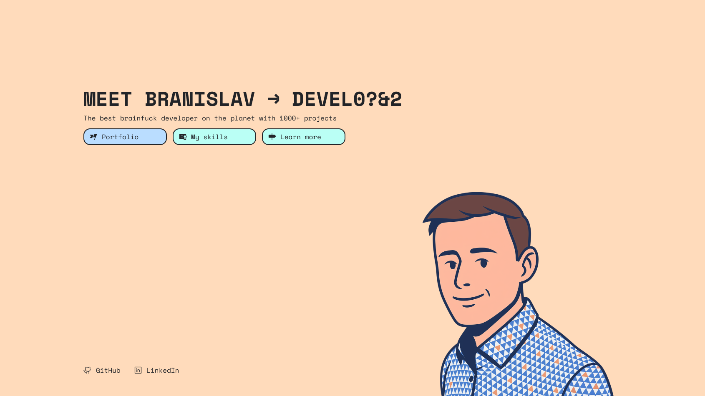

# DN Juhaas

   

## Description

**DN Juhaas** is a personal portfolio and website designed to showcase projects, skills, and professional information of its author, Branislav Juhás. It is built with a focus on a clean user interface, performance, and responsiveness. The project utilizes modern web technologies to provide a seamless and engaging user experience. The content is dynamically managed through Nuxt Studio, allowing for easy and efficient updates.

## Access Point

The DN Juhaas website can be accessed through the following URL:

- [https://juhaas.eu](https://juhaas.eu)

## Setup Instructions

1.  Clone the repository to your local machine.
2.  Navigate to the project directory.
3.  Install the necessary dependencies by running `npm install`.
4.  Start the development server by running `npm run dev`.
5.  The application should now be running on your local machine at `http://localhost:3000`.

## Remarks

This project is a living portfolio and is subject to continuous updates and changes.

---

Since its official integration into the DN Family the DN Juhaas project has proudly embraced the organization's core values of openness, innovation, and philanthropy.
